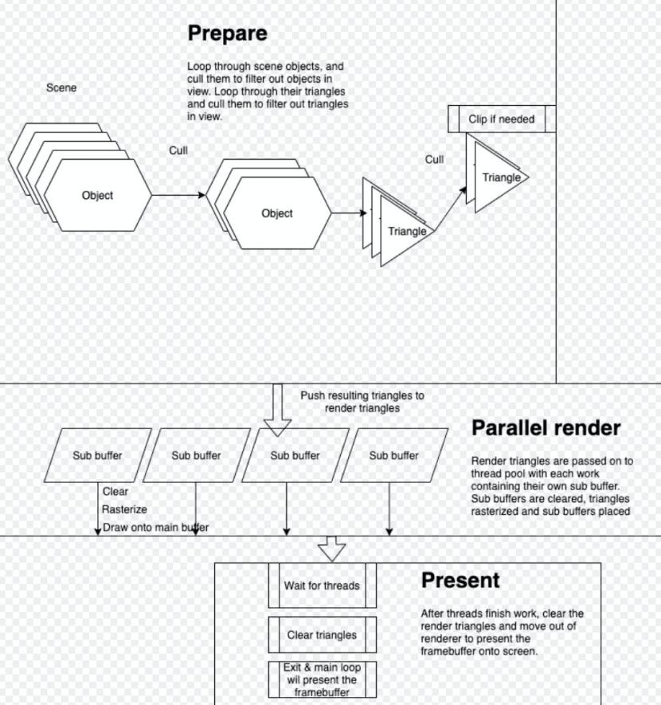

# Documentation of the app architecture

## `src/doom3d.c`: Entry point to the app

- Initialize app & threadpool
- Load first `src/scene`
- After loading first scene, main loop is run like:

```c
	while (app->is_running)
	{
		window_frame_clear(app->window);
		events_handle(app);
		doom3d_render(app);
		window_frame_draw(app->window);
	}
```

- `events_handle` function is an entry point for app's state organization. Events are read and based on that app state gets changed
- `doom3d_render` will then render the changed state (see Renderer flow chart)
- The framebuffer is then placed onto the window screen
- After exiting the app all data strucures are freed in `doom3d_cleanup`

## Scenes

- Hold all objects
- Menu options
- Triangle pointers for e.g. ray intersection calculation
- All in-game related data (except the player (could be in scene))

## Rendering



- Objects & triangles are culled based on camera viewbox
- Remaining triangles are copied, clipped onto `render_triangles` and their vertices are transformed for the rasterizer so that their origin is 0, 0, 0
- In parlallel:
  - Buffers are cleared
  - Triangles are rasterized
  - Buffers are drawn onto main buffer
- These `render_triangles` are then freed
- Main buffer will then be presented onto window

## Player sprite animations

Main struct defining an animation

```c
/*
** @id: Animation id, e.g. t_player_animation anim_shotgun_shoot
** @frames: frame information, dimensions and offsets
** @current_frame: index of currently shown frame
** @frame_time: how long each frame is shown
** @frame_time_left: update decrements this until <= 0 and moves on to next frame
** @interruptable: whether animation can be interrupted
** @is_finised: when last frame is shown, animation is set to be finished
**   uninterruptable animations are not overridden unless they are finised
*/

typedef struct				s_sprite_anim
{
	uint32_t				id;
	t_anim_frame			frames[MAX_ANIMATION_FRAMES];
	int32_t					num_frames;
	int32_t					current_frame;
	int32_t					frame_time;
	int32_t					frame_time_left;
	t_bool					interruptable;
	t_bool					is_finished;
}							t_sprite_anim;
```

Player animations work as follows:

**INIT**
1. Set animation source files in `scene_assets.c` and call keys in `get_animation_source`
2. Define animation frame information and their corresponding ids
(`player_animations.c`, ids under `t_player_animation`), call them in `player_animations_init`

**UPDATE**
1. Define which weapon sets which animation in default, shoot and reload
e.g `set_player_reload_frame`
2. Update animation frames and loop them in `doom3d_player_animation_update`
every frame, and decrement frame time with `delta_time`. This is called in main loop.

**DISPLAY**
1. Render right frame in `player_hud.c` in `player_animation_render`

## Libs

Easiest way to learn how to use a function is to cmd+shift+f (app wide search) in your IDE and see where a function has been used.

- `lib3d`: 3d library holding all data structures and functionality that are general and not specific to doom3d.
  - 2D line drawing
  - Rasterization
  - Pixel plotting
  - Useful data structs
  - 3d .obj file reading
  - 3d object instantiation
  - bmp image reading
  - image placement from surface to surface (e.g. bmp onto framebuffer)
- `libgmatrix`: Vector and matrix math
- `libft`: c stdlib style functions and useful added functions on top of those
  - Hash(map/table), see `scene/assets/c` for usage, or `libft/tests`
  - Threadpool (see usage in `src/render/render.c`: `render_work_parallel` & `src/doom3d.c`: `doom3d_run`)
  - File reading (See `l3d_read_obj` for usage)
